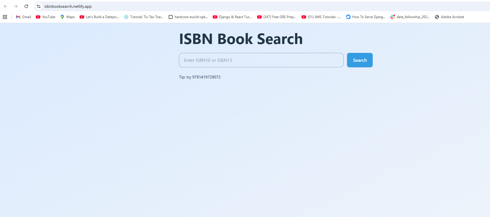

# 📖 ISBN Book Search App

A scrappy but functional **Full Stack Web App** where users can enter an ISBN number and instantly fetch book details such as **title, authors, publisher, publish date, and cover image**.

Built as part of a full-stack developer assessment using **Django + React**.

---

## ✨ Features
- 🔍 Search books by ISBN (supports ISBN-10 and ISBN-13)
- 📡 Public APIs integration (OpenLibrary + Google Books fallback)
- ⚛️ Modern React frontend (JSX + Vite + Tailwind CSS)
- 🐍 Django REST backend with clean API endpoint
- 🐳 Docker-based workflow for backend
- 📱 Responsive UI
- 🚀 Deployed live (Render.com for backend + Netlify for frontend)

---

## ⚙️ Tech Stack
**Frontend**
- React (Vite, JSX)
- Tailwind CSS
- Fetch API

**Backend**
- Python 3.x
- Django + Django REST Framework
- Requests + isbnlib (for ISBN normalization & conversion)

**Other**
- PostgreSQL (can run on SQLite locally for demo)
- Docker + Docker Compose
- Render.com (backend deployment)
- Netlify (frontend deployment)

---

## 🛠️ Setup Instructions

### 1️⃣ Clone the repository
```bash
git clone https://github.com/your-username/isbn-book-search.git
cd isbn-book-search
```

---

### 2️⃣ Backend (Django API)

#### Create virtual environment
```bash
cd backend
python -m venv venv
source venv/bin/activate   # on Linux/Mac
venv\Scripts\activate      # on Windows
```

#### Install dependencies
```bash
pip install -r requirements.txt
```

#### Run migrations
```bash
python manage.py migrate
```

#### Start server
```bash
python manage.py runserver
```

API will be live at:
👉 `http://localhost:8000/api/books/<isbn>/`

---

### 3️⃣ Frontend (React + Vite)

#### Install dependencies
```bash
cd frontend
npm install
```

#### Create `.env` file
```bash
VITE_BOOKS_API_BASE_URL=http://localhost:8000
```

#### Start development server
```bash
npm run dev
```

Frontend will be live at:
👉 `http://localhost:5173`

---

## 🌍 Deployment

### Backend (Render)
1. Go to Render → create a new Web Service.
2. Connect your GitHub repo and select the backend folder as the root..
3. Set the start command depending on your backend
4. Add environment variable:
   ```
   GOOGLE_BOOKS_API_KEY="Your secret key here"
   ```
5. Deploy.

Backend will be available at:
👉 `https://your-backend.onrender.com`

### Frontend (Netlify)
1. Import frontend folder in [Netlify](https://www.netlify.com/).
2. Select the frontend folder as the root.
3. Set build settings:
   - Build command: npm run build
   - Publish directory: dist
4. Add environment variable:
   ```
   VITE_BOOKS_API_BASE_URL=https://your-backend.onrender.com
   ```
5. Deploy.

Frontend will be available at:
👉 `https://your-frontend.netlify.app`

---

## 📚 Example ISBNs
Try these ISBNs in the app:
- `9780140328721` → *Matilda* (Roald Dahl)
- `9780439139601` → *Harry Potter and the Goblet of Fire*
- `9780385472579` → *Zen and the Art of Motorcycle Maintenance*
- `9780261103573` → *The Lord of the Rings*
- `9780061120084` → *To Kill a Mockingbird*

---
## Demo Screenshots:
 ### Home Page
 
 ### Book Search Result
 

---

## 🤖 AI & Tooling Transparency
This project actively leveraged AI tools to improve productivity and quality:

- **ChatGPT (OpenAI)** → scaffolding Django/React boilerplate, refining README, clarifying ISBN normalization (handling ISBN-10 vs ISBN-13, stripping dashes/spaces, and dealing with edge cases like trailing `X`), suggesting reliable public data sources (OpenLibrary, Google Books) when some ISBNs weren’t returning results, configuring server settings and deployment.

- **GitHub Copilot** → autocomplete for repetitive code patterns and React hooks

- **Cursor AI** → quick refactoring and style adjustments in code

All generated code was reviewed and tested before inclusion.

---


